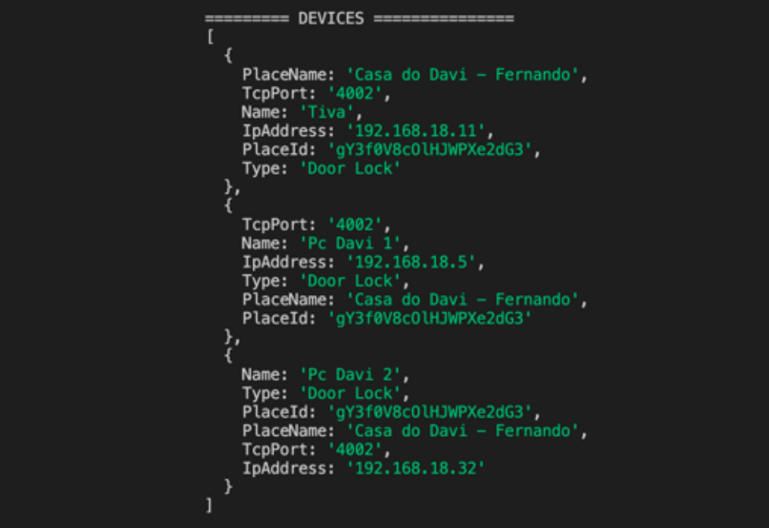
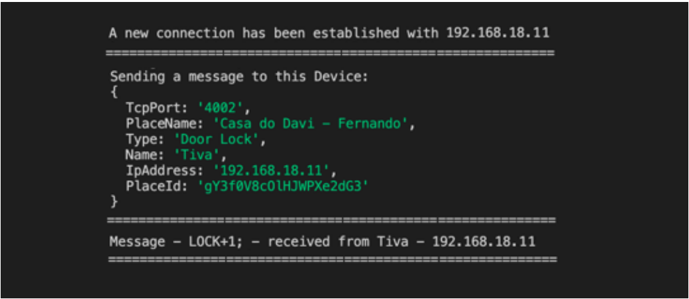

# React IOT Server Side Application Project

This is a IOT server side project to simulate a server that can handle TCP and HTTP requests to allow communications between a web page and one or more micro-controllers

# How to Run Application

1 - Npm Install

2 - Npm Start

# Concepts and Javascript Fundamentals

- HTTP Servers: This server is used to listen/send information to a web page

- TCP Servers: This server is used to listen/send information to a device

- Firebase Connection to Retrieve Ip and Places Information

# Project Images

- Devices Log Information

- Server Sending Message

